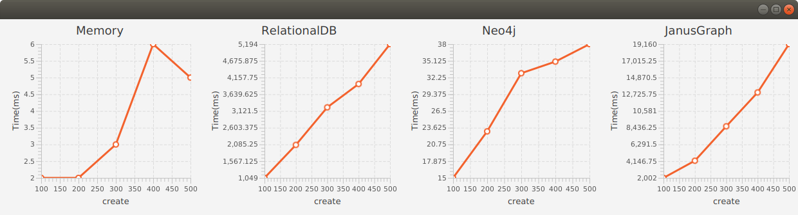
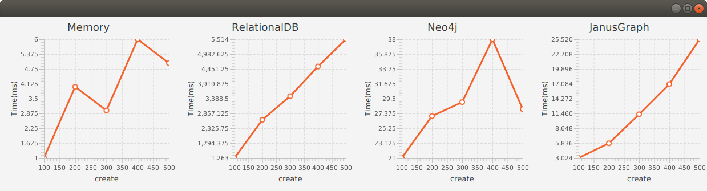
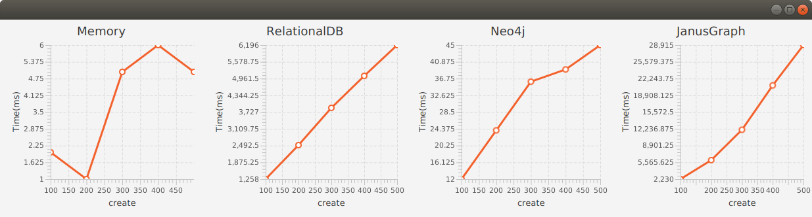
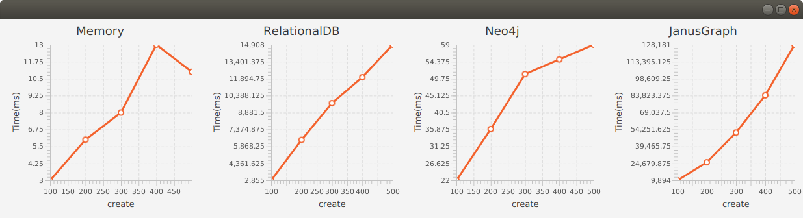
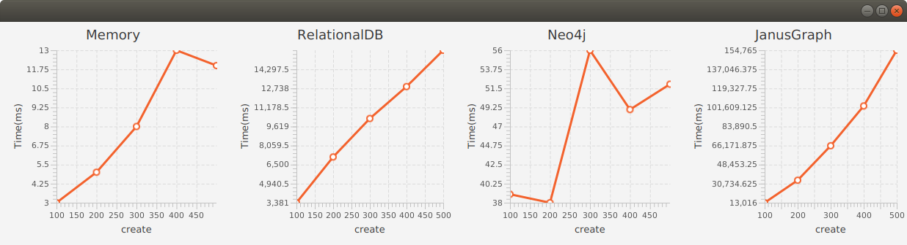
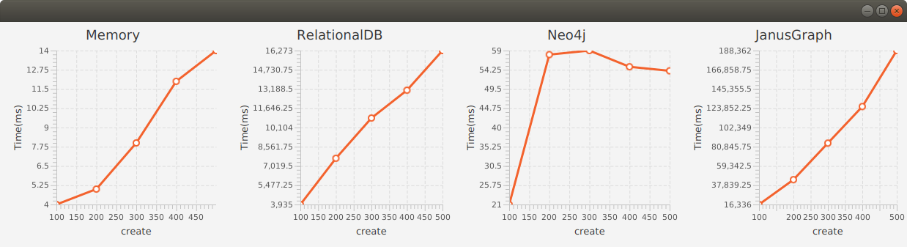

# Performance Results

See [RandomTreeModel](/src/main/java/atomspace/performance/tree)

# Create atoms

Max RandomTreeModel parameters:

|                       |    |
|-----------------------|----|
| tree width and height |  3 |
| types and Values      | 10 |

Created Nodes and Links:

| Statements | 100 | 200 | 300 | 400 | 500 |
|------------|-----|-----|-----|-----|-----|
| Nodes      |  99 | 100 | 100 | 100 | 100 |
| Links      | 250 | 492 | 731 | 970 |1210 |

Max RandomTreeModel parameters:

|                       |    |
|-----------------------|----|
| tree width and height |  3 |
| types and values      | 20 |

Created Nodes and Links:

| Statements | 100 | 200 | 300 | 400 | 500 |
|------------|-----|-----|-----|-----|-----|
| Nodes      | 252 | 345 | 375 | 393 | 398 |
| Links      | 253 | 498 | 744 | 995 |1250 |

Max RandomTreeModel parameters:

|                       |    |
|-----------------------|----|
| tree width and height |  3 |
| types and values      | 30 |

Created Nodes and Links:

| Statements | 100 | 200 | 300 | 400 | 500 |
|------------|-----|-----|-----|-----|-----|
| Nodes      | 323 | 524 | 654 | 724 | 785 |
| Links      | 253 | 499 | 745 | 996 |1251 |

Max RandomTreeModel parameters:

|                       |    |
|-----------------------|----|
| tree width and height |  5 |
| types and Values      | 10 |

Created Nodes and Links:

| Statements | 100 | 200 | 300 | 400 | 500 |
|------------|-----|-----|-----|-----|-----|
| Nodes      | 100 | 100 | 100 | 100 | 100 |
| Links      | 701 |1392 |2048 |2601 |3191 |

Max RandomTreeModel parameters:

|                       |    |
|-----------------------|----|
| tree width and height |  5 |
| types and Values      | 20 |

Created Nodes and Links:

| Statements | 100 | 200 | 300 | 400 | 500 |
|------------|-----|-----|-----|-----|-----|
| Nodes      | 375 | 396 | 400 | 400 | 400 |
| Links      | 715 |1440 |2141 |2753 |3427 |

Max RandomTreeModel parameters:

|                       |    |
|-----------------------|----|
| tree width and height |  5 |
| types and Values      | 30 |

Created Nodes and Links:

| Statements | 100 | 200 | 300 | 400 | 500 |
|------------|-----|-----|-----|-----|-----|
| Nodes      | 652 | 835 | 879 | 898 | 899 |
| Links      | 716 |1441 |2151 |2774 |3462 |

