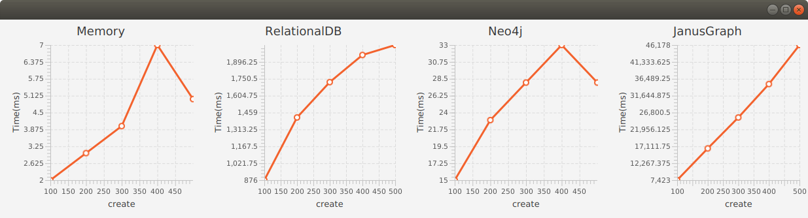
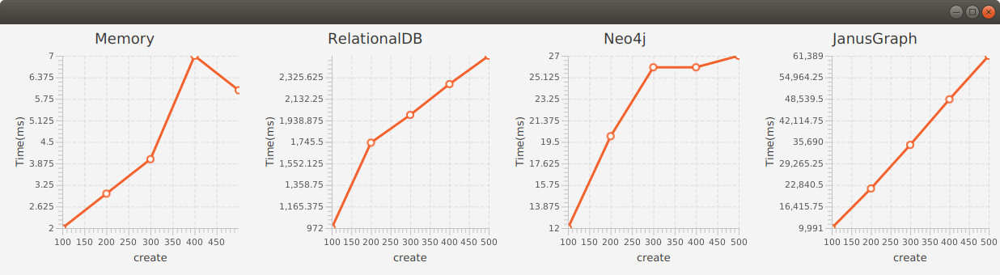
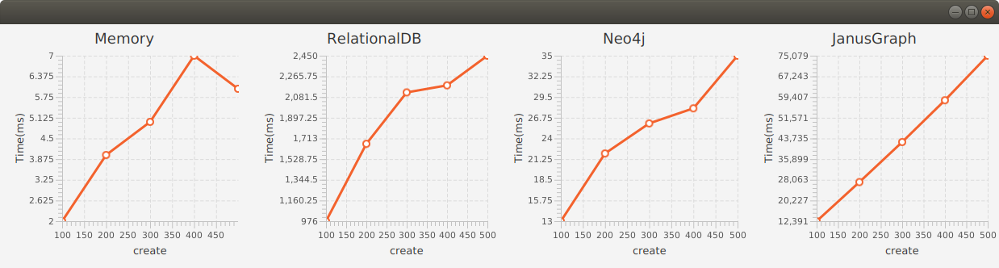

# Performance Results

See [RandomTreeModel](/src/main/java/atomspace/performance/tree)

RandomTreeModel has the following base parameters:
* max tree width and height
* max types and values
* max variables
* statements and queries

# Create atoms

## Max tree width 3 and height 3

RandomTreeModel parameters.

Max tree width and height:

| width   |  3 |
|---------|----|
| height  |  3 |

Max types and values:

| types   |  10 |
|---------|-----|
| values  |  10 |

Created Nodes and Links:

| Statements | 100 | 200 | 300 | 400 | 500 |
|------------|-----|-----|-----|-----|-----|
| Nodes      |  99 | 100 | 100 | 100 | 100 |
| Links      | 250 | 492 | 731 | 970 |1210 |

Max types and values:

| types   |  20 |
|---------|-----|
| values  |  20 |

Created Nodes and Links:

| Statements | 100 | 200 | 300 | 400 | 500 |
|------------|-----|-----|-----|-----|-----|
| Nodes      | 252 | 345 | 375 | 393 | 398 |
| Links      | 253 | 498 | 744 | 995 |1250 |

Max types and values:

| types   |  30 |
|---------|-----|
| values  |  30 |

Created Nodes and Links:

| Statements | 100 | 200 | 300 | 400 | 500 |
|------------|-----|-----|-----|-----|-----|
| Nodes      | 323 | 524 | 654 | 724 | 785 |
| Links      | 253 | 499 | 745 | 996 |1251 |

## Max tree width 5 and height 5

RandomTreeModel parameters.

Max tree width and height:

| width   |  5 |
|---------|----|
| height  |  5 |

Max types and values:

| types   |  10 |
|---------|-----|
| values  |  10 |

Created Nodes and Links:

| Statements | 100 | 200 | 300 | 400 | 500 |
|------------|-----|-----|-----|-----|-----|
| Nodes      | 100 | 100 | 100 | 100 | 100 |
| Links      | 701 |1392 |2048 |2601 |3191 |

Max types and values:

| types   |  20 |
|---------|-----|
| values  |  20 |

Created Nodes and Links:

| Statements | 100 | 200 | 300 | 400 | 500 |
|------------|-----|-----|-----|-----|-----|
| Nodes      | 375 | 396 | 400 | 400 | 400 |
| Links      | 715 |1440 |2141 |2753 |3427 |

Max types and values:

| types   |  30 |
|---------|-----|
| values  |  30 |

Created Nodes and Links:

| Statements | 100 | 200 | 300 | 400 | 500 |
|------------|-----|-----|-----|-----|-----|
| Nodes      | 652 | 835 | 879 | 898 | 899 |
| Links      | 716 |1441 |2151 |2774 |3462 |

# Query atoms

## Max tree width 3 and height 3

Max RandomTreeModel parameters:

|                       |     |
|-----------------------|-----|
| variables             |   3 |
| statements            | 200 |

Max tree width and height:

| width   |  3 |
|---------|----|
| height  |  3 |

Max types and values:

| types   |  10 |
|---------|-----|
| values  |  10 |

Created Nodes and Links:

| Queries    | 100 | 200 | 300 | 400 | 500 |
|------------|-----|-----|-----|-----|-----|
| Nodes      | 175 | 191 | 194 | 194 | 196 |
| Links      | 669 | 758 | 810 | 843 | 871 |

Max RandomTreeModel parameters:

Max types and values:

| types   |  20 |
|---------|-----|
| values  |  20 |

Created Nodes and Links:

| Queries    | 100 | 200 | 300 | 400 | 500 |
|------------|-----|-----|-----|-----|-----|
| Nodes      | 473 | 534 | 558 | 577 | 590 |
| Links      | 673 | 762 | 814 | 847 | 875 |

Max RandomTreeModel parameters:

| types   |  30 |
|---------|-----|
| values  |  30 |

Created Nodes and Links:

| Queries    | 100 | 200 | 300 | 400 | 500 |
|------------|-----|-----|-----|-----|-----|
| Nodes      | 683 | 753 | 787 | 804 | 827 |
| Links      | 674 | 763 | 815 | 848 | 876 |

