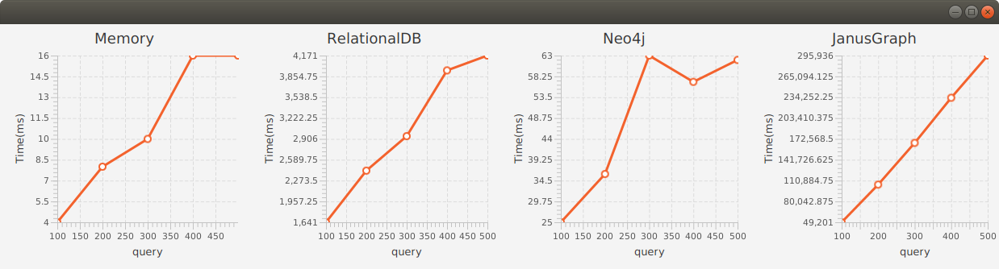
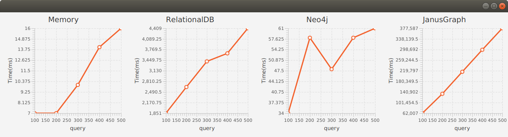
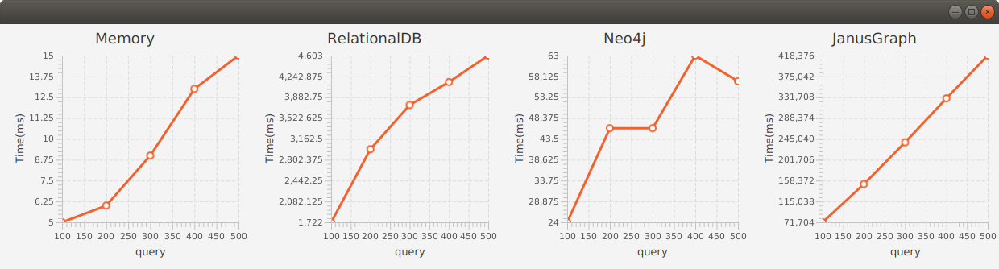

# Performance Results

See [RandomTreeModel](/src/main/java/atomspace/performance/tree)

RandomTreeModel has the following base parameters:
* max tree width and height
* max types and values
* max variables
* statements and queries

# Create atoms

## Max tree width 3 and height 3

RandomTreeModel parameters.

Max tree width and height:

| width   |  3 |
|---------|----|
| height  |  3 |

Example of random trees with max width 3 and height 3:
```scheme
Link0(
 Link1(
  Node2('Value0')
  Node0('Value2'))
 Link0(
  Node2('Value0'))
 Link0(
  Node0('Value1')))

Link0(
 Node2('Value2')
 Node1('Value2'))

Link2(
 Link0(
  Node2('Value0')
  Node1('Value2')
  Node2('Value0'))
 Link2(
  Node1('Value0')
  Node2('Value2')
  Node2('Value1'))
 Link0(
  Node2('Value2')))
```

Max types and values:

| types   |  10 |
|---------|-----|
| values  |  10 |

Created Nodes and Links:

| Statements | 100 | 200 | 300 | 400 | 500 |
|------------|-----|-----|-----|-----|-----|
| Nodes      |  99 | 100 | 100 | 100 | 100 |
| Links      | 250 | 492 | 731 | 970 |1210 |


Max types and values:

| types   |  20 |
|---------|-----|
| values  |  20 |

Created Nodes and Links:

| Statements | 100 | 200 | 300 | 400 | 500 |
|------------|-----|-----|-----|-----|-----|
| Nodes      | 252 | 345 | 375 | 393 | 398 |
| Links      | 253 | 498 | 744 | 995 |1250 |


Max types and values:

| types   |  30 |
|---------|-----|
| values  |  30 |

Created Nodes and Links:

| Statements | 100 | 200 | 300 | 400 | 500 |
|------------|-----|-----|-----|-----|-----|
| Nodes      | 323 | 524 | 654 | 724 | 785 |
| Links      | 253 | 499 | 745 | 996 |1251 |


## Max tree width 5 and height 5

RandomTreeModel parameters.

Max tree width and height:

| width   |  5 |
|---------|----|
| height  |  5 |

Example of a random tree with max width 5 and height 5:

```scheme
Link3(
 Link4(
  Link2(
   Node3('Value0'))
  Link4(
   Node3('Value4')
   Node3('Value1')
   Node3('Value1'))
  Link2(
   Node4('Value0')))
 Link0(
  Link3(
   Node3('Value3'))
  Link1(
   Node3('Value4')))
 Link4(
  Link0(
   Node2('Value0')
   Node2('Value1'))
  Link4(
   Node4('Value4')))
 Link4(
  Node4('Value3')
  Node0('Value3')
  Node2('Value1')
  Node0('Value2'))
 Link0(
  Link4(
   Node4('Value2'))
  Link2(
   Node4('Value1')
   Node3('Value4'))))
```

Max types and values:

| types   |  10 |
|---------|-----|
| values  |  10 |

Created Nodes and Links:

| Statements | 100 | 200 | 300 | 400 | 500 |
|------------|-----|-----|-----|-----|-----|
| Nodes      | 100 | 100 | 100 | 100 | 100 |
| Links      | 701 |1392 |2048 |2601 |3191 |


Max types and values:

| types   |  20 |
|---------|-----|
| values  |  20 |

Created Nodes and Links:

| Statements | 100 | 200 | 300 | 400 | 500 |
|------------|-----|-----|-----|-----|-----|
| Nodes      | 375 | 396 | 400 | 400 | 400 |
| Links      | 715 |1440 |2141 |2753 |3427 |


Max types and values:

| types   |  30 |
|---------|-----|
| values  |  30 |

Created Nodes and Links:

| Statements | 100 | 200 | 300 | 400 | 500 |
|------------|-----|-----|-----|-----|-----|
| Nodes      | 652 | 835 | 879 | 898 | 899 |
| Links      | 716 |1441 |2151 |2774 |3462 |


# Query atoms

Max RandomTreeModel parameters:

| variables             |   3 |
|-----------------------|-----|
| statements            | 200 |

## Max tree width 3 and height 3

Max tree width and height:

| width   |  3 |
|---------|----|
| height  |  3 |

Example of query random trees with max width 3, height 3, and variables 3:

```scheme
Link2(
 Link1(
  VariableNode('$NODE0_VALUE2')
  VariableNode('$NODE1_VALUE1'))
 Link0(
  Node1('Value1')))

Link1(
 Link2(
  VariableNode('$NODE0_VALUE1'))
 Link0(
  VariableNode('$NODE1_VALUE2'))
 Link2(
  VariableNode('$NODE0_VALUE1')
  Node0('Value0')
  Node1('Value0')))
 ```

Max types and values:

| types   |  10 |
|---------|-----|
| values  |  10 |

Created Nodes and Links:

| Queries    | 100 | 200 | 300 | 400 | 500 |
|------------|-----|-----|-----|-----|-----|
| Nodes      | 175 | 191 | 194 | 194 | 196 |
| Links      | 669 | 758 | 810 | 843 | 871 |


Max RandomTreeModel parameters:

Max types and values:

| types   |  20 |
|---------|-----|
| values  |  20 |

Created Nodes and Links:

| Queries    | 100 | 200 | 300 | 400 | 500 |
|------------|-----|-----|-----|-----|-----|
| Nodes      | 473 | 534 | 558 | 577 | 590 |
| Links      | 673 | 762 | 814 | 847 | 875 |


Max RandomTreeModel parameters:

| types   |  30 |
|---------|-----|
| values  |  30 |

Created Nodes and Links:

| Queries    | 100 | 200 | 300 | 400 | 500 |
|------------|-----|-----|-----|-----|-----|
| Nodes      | 683 | 753 | 787 | 804 | 827 |
| Links      | 674 | 763 | 815 | 848 | 876 |


## Max tree width 5 and height 5

Max tree width and height:

| width   |  5 |
|---------|----|
| height  |  5 |

Example of a query random tree with max width 5, height 5, and variables 3:

```scheme
Link3(
 Link4(
  Link2(
   VariableNode('$NODE3_VALUE0'))
  Link4(
   Node3('Value4')
   VariableNode('$NODE3_VALUE1')
   VariableNode('$NODE3_VALUE1'))
  Link2(
   Node4('Value0')))
 Link0(
  Link3(
   Node3('Value3'))
  Link1(
   Node3('Value4')))
 Link4(
  Link0(
   Node2('Value0')
   Node2('Value1'))
  Link4(
   Node4('Value4')))
 Link4(
  Node4('Value3')
  Node0('Value3')
  Node2('Value1')
  Node0('Value2'))
 Link0(
  Link4(
   Node4('Value2'))
  Link2(
   Node4('Value1')
   Node3('Value4'))))
 ```

Max types and values:

| types   |  10 |
|---------|-----|
| values  |  10 |

Created Nodes and Links:

| Queries    | 100 | 200 | 300 | 400 | 500 |
|------------|-----|-----|-----|-----|-----|
| Nodes      |  185|  194|  198|  199|  199|
| Links      | 1715| 1847| 1975| 2033| 2077|



Max types and values:

| types   |  20 |
|---------|-----|
| values  |  20 |

Created Nodes and Links:

| Queries    | 100 | 200 | 300 | 400 | 500 |
|------------|-----|-----|-----|-----|-----|
| Nodes      |  567|  616|  652|  668|  676|
| Links      | 1772| 1904| 2033| 2091| 2136|



Max types and values:

| types   |  30 |
|---------|-----|
| values  |  30 |

Created Nodes and Links:

| Queries    | 100 | 200 | 300 | 400 | 500 |
|------------|-----|-----|-----|-----|-----|
| Nodes      | 1000| 1077| 1146| 1168| 1190|
| Links      | 1777| 1910| 2040| 2098| 2143|


