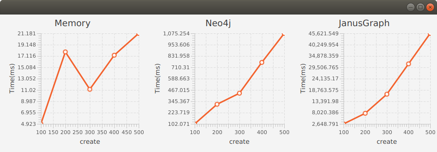
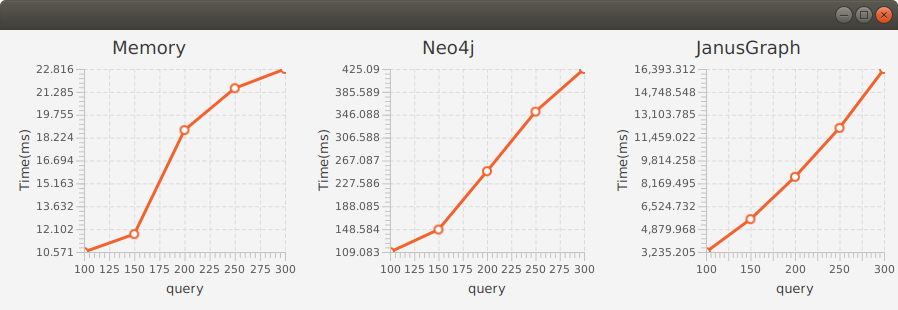

# Performance Measurement

[PerformanceModel](PerformanceModel.java)

Models:
* [RandomTreeModel](tree/RandomTreeModel.java)

## RandomTreeModel

The following parameters has been used for atoms creation and querying in RandomTreeModel.

Model configuration:

|Model configuration|value|
|-------------------|-----|
|node types         |5    |
|value types        |5    |
|values per types   |5    |

RandomTree model parameters:

| RandomTree parameters|value|
|----------------------|-----|
|max width             |5    |
|max depth             |5    |
|max variables         |2    |

### Create Atoms

[Atoms create benchmark](tree/RandomTreeCreateAtomsBenchmark.java)

### Query Atoms

[Atoms query benchmark](tree/RandomTreeQueryAtomsBenchmark.java)

